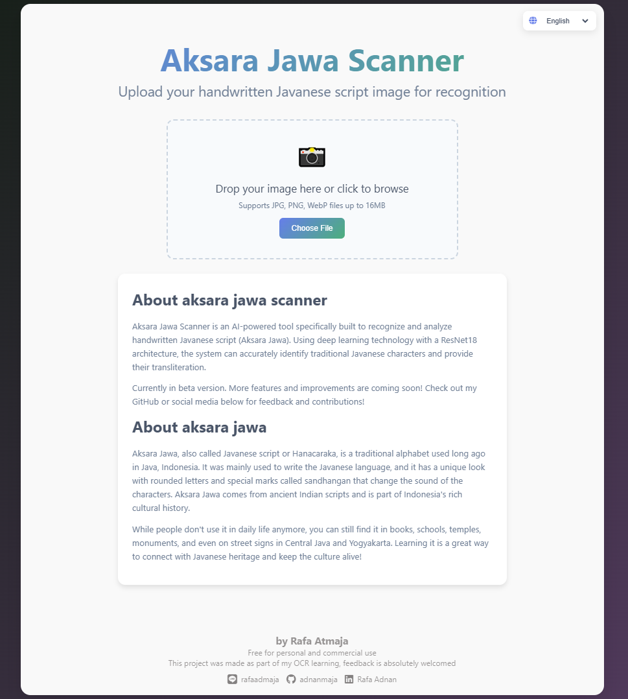

# 🧠 Aksara Jawa Classifier

A lightweight Flask-based web API that classifies Javanese script (Aksara Jawa) using ONNX-optimized models.  
Designed for speed, low memory usage, and easy integration into web frontends.

This project aims to preserve and promote the Javanese script by enabling machine-based recognition of its characters, including:
- **Aksara Nglegena**
- **Sandhangan**
- **Pasangan**
- **Angka** (Coming soon)

## 🚀 Live Demo

Frontend: [https://www.nulisjawa.my.id](https://www.nulisjawa.my.id)  
> Currently in beta — more features and improvements are on the way!

---

## 🧭 Problem Statement
Back in high school, I lowkey hated Javanese class. One of the biggest reasons? Aksara Jawa. The traditional script felt difficult to learn, and the lack of digital tools made it even more frustrating. I remember searching desperately for an image-to-text translator for Javanese characters - literally none existed.

Years later, I realized this wasn't just my personal struggle. Javanese script (Aksara Jawa) is a traditional writing system used by over 75 million Javanese speakers, yet it faces the risk of digital extinction. The same barriers that made me hate learning it in school - complexity and lack of accessible tools - are preventing an entire generation from connecting with their cultural heritage.

This project is my attempt to solve the problem that once frustrated teenage me: creating the image-to-text Aksara Jawa translator that didn't exist when I needed it most.

---

## 📦 Key Features
- **Multi-character Support:** Recognizes Aksara Nglegena (basic characters), Sandhangan (diacritics), and Pasangan (consonant clusters)
- **High accuracy:** Achieves 93.40% classification accuracy on custom dataset with augmentation
- **Optimized inference:** ResNet18 architecture fine-tuned with PyTorch and powered by ONNX for fast, CPU-friendly inference
- **Production ready:** Dockerized API deployed on Azure Container Apps with HTTPS
- **Web interface:** Clean, responsive frontend for easy testing and demonstration, hosted with GitHub Pages + custom domain

---

## 🧰 Tech Stack
| Layer        | Tool                                 |
|--------------|--------------------------------------|
| Backend      | Python Flask + ONNX Runtime          |
| ML Framework | PyTorch (training) → ONNX (inference)|
| Container    | Docker                               |
| Deployment   | Azure Container App (API)            |
| Frontend     | Vanilla HTML/CSS/JS via GitHub Pages |
| Domain       | Custom `.my.id` domain with SSL      |

---

## 🧪 Technicals
  

###  Machine Learning Pipeline
Raw Images → Data Augmentation → Role Mapping → ResNet18 (Fine-tuned) → ONNX Model → Flask API

### Model Specification
- **Architecture:** ResNet18 with transfer learning from ImageNet
- **Framework:** PyTorch for training, ONNX Runtime for inference
- **Dataset:**  Custom-built dataset of 30,000+ segmented Javanese characters
- **Preprocessing:** Image normalization, augmentation (rotation, scaling, noise)
- **Optimizer:** Adam
- **Loss Function:** CrossEntropyLoss
- **Training:** 30 epochs, Adam optimizer, CrossEntropyLoss
- **Validation:** 70/15/15 train-validation-test split with stratified sampling

### Performance Metrics
- **Overall Accuracy:** 93.40%
- **Inference Time:** ~50ms per character (CPU)
- **Model Size:** 45MB (ONNX optimized)
- **API Response Time:** <200ms average

### Dataset Details
- **Size:** 30,000+ segmented character images
- **Sources:** Traditional manuscripts, Automated generations, hand-drawn samples
- **Augmentation:** Rotation, scaling, noise injection, shear, color jitter
- **Format:** 224x224 RGB images, PNG format
- **Annotation:** Manual labeling with quality validation

> Dataset will be released publicly once documentation is complete.

---

## 📷 Web Interface
   

---
## 📗 Code Examples 
### Model training pipeline
<pre>
# Setting up the model (ResNet18)
device = torch.device('cuda' if torch.cuda.is_available() else 'cpu')
num_classes = len(train_dataset.classes)

model = torchvision.models.resnet18(weights=ResNet18_Weights.DEFAULT)
model.fc = nn.Linear(model.fc.in_features, num_classes)
model.to(device)
criterion = nn.CrossEntropyLoss(label_smoothing=0.1)
optimizer = torch.optim.Adam(model.parameters(), lr=0.0001)
scheduler = torch.optim.lr_scheduler.CosineAnnealingLR(optimizer, T_max=30)

# Agressive augmentation due to small dataset size
train_transform = transforms.Compose([
    transforms.Resize((224, 224)),
    transforms.RandomRotation(degrees=(-20, 20)),
    transforms.RandomAffine(
        degrees=0,
        translate=(0.1, 0.1), 
        scale=(0.8, 1.2),     
        shear=(-15, 15)       
    ),
    transforms.ColorJitter(brightness=0.2, contrast=0.2, saturation=0.2, hue=0.1),
    transforms.ToTensor(),
    transforms.Normalize(mean=[0.485, 0.456, 0.406], std=[0.229, 0.224, 0.225])
])

# Training Loop
num_epochs = 30  # Diminishing return after 30 epochs

for epoch in range(num_epochs):
    model.train()
    total_loss = 0
    
    for batch in train_loader:
        if len(batch) == 2:
            images, labels = batch
        else:
            images, labels = batch[0], batch[1] 
        images, labels = images.to(device), labels.to(device)
        
        # Forward pass
        outputs = model(images)
        loss = criterion(outputs, labels)
        
        # Backward pass
        optimizer.zero_grad()
        loss.backward()
        optimizer.step()
        scheduler.step()
        
        total_loss += loss.item()

    # Evaluation after each epochs
    model.eval()
    val_correct = 0
    val_total = 0
    with torch.no_grad():
        for val_images, val_labels in val_loader:
            val_images, val_labels = val_images.to(device), val_labels.to(device)
            val_outputs = model(val_images)
            val_preds = val_outputs.argmax(dim=1)
            val_correct += (val_preds == val_labels).sum().item()
            val_total += val_labels.size(0)

    val_acc = 100 * val_correct / val_total  
    print(f'Epoch {epoch+1}/{num_epochs}, Loss: {total_loss/len(train_loader):.4f}')
    print(f"Validation Accuracy: {val_acc:.2f}%")
</pre>

### Image Segmentation
<pre>
def segment_by_projection(pil_image, min_char_width=5, min_char_height=5):
    """
    Segment image into character glyphs using projection profiles.
    Returns: List of {image: PIL.Image, bbox: (x, y, w, h)}
    """
    img = pil_image.convert('L')
    gray = np.array(img)
    _, binary = cv2.threshold(gray, 0, 255, cv2.THRESH_BINARY_INV + cv2.THRESH_OTSU)

    # Line segmentation
    horizontal_sum = np.sum(binary, axis=1)
    line_boundaries = []
    in_line = False
    for i, val in enumerate(horizontal_sum):
        if val > 0 and not in_line:
            start = i
            in_line = True
        elif val == 0 and in_line:
            end = i
            in_line = False
            if end - start > min_char_height:
                line_boundaries.append((start, end))

    segments = []

    # Character segmentation within each line 
    for (y1, y2) in line_boundaries:
        line_img = binary[y1:y2, :]
        vertical_sum = np.sum(line_img, axis=0)
        in_char = False
        char_start = 0
        for x in range(len(vertical_sum)):
            if vertical_sum[x] > 0 and not in_char:
                char_start = x
                in_char = True
            elif vertical_sum[x] == 0 and in_char:
                char_end = x
                in_char = False
                w = char_end - char_start
                h = y2 - y1
                if w > min_char_width and h > min_char_height:
                    char_crop = gray[y1:y2, char_start:char_end]
                    padded_img = pad_and_resize(char_crop, size=224, pad_color=255, padding=90)
                    segments.append({
                        'image': padded_img,
                        'bbox': (char_start, y1, w, h)
                    })
    return segments
</pre>
### Prediction logic
<pre>
def basePredict(image):
    base_session = ort.InferenceSession("ONNX_MODELS/aksaraUpdate.onnx", providers=["CPUExecutionProvider"])
    input_data = preprocess_image(image)
    
    # Run inference
    outputs = base_session.run(None, {"input": input_data})
    logits = outputs[0]
    
    # Apply softmax and get prediction
    probs = np.exp(logits) / np.sum(np.exp(logits), axis=1, keepdims=True)
    pred_idx = np.argmax(probs)
    confidence = probs[0][pred_idx]
    
    print(f"[BASE] Predicted {label_map[pred_idx]} with confidence {confidence:.2f}")
    return label_map[pred_idx]
</pre>
### API Inference
<pre>
@app.route('/', methods=['POST'])
def predict():
    try:
        # Check if file is present in request
        if 'file' not in request.files:
            return jsonify({'error': 'No file provided'}), 400
        
        print("File received")
        file = request.files['file']
        
        # Check if file is selected
        if file.filename == '':
            return jsonify({'error': 'No file selected'}), 400
        
        # Check if file type is allowed
        if not allowed_file(file.filename):
            return jsonify({'error': 'File type not allowed'}), 400
        
        # Read and process the image
        img_bytes = file.read()
        print(f"Image read, size: {len(img_bytes)} bytes")
        pil_image = Image.open(io.BytesIO(img_bytes)).convert("RGB")
        char_segments = segment_by_projection(pil_image)

        bboxes = [seg['bbox'] for seg in char_segments]
        avg_h = np.mean([h for _, _, _, h in bboxes])
        avg_y = np.mean([y for _, y, _, _ in bboxes])

        for seg in char_segments:  # DEBUG
            print(f"Segment: bbox={seg['bbox']}, h={seg['bbox'][3]}, cy={seg['bbox'][1] + seg['bbox'][3]/2}, role={classify_region(seg['bbox'], avg_h, avg_y)}")

        base_preds = []
        sandhangan_preds = []
        pasangan_preds = []

        base_debug = []
        sandhangan_debug = []
        pasangan_debug = []
        
        for seg in char_segments:
            role = classify_region(seg['bbox'], avg_h, avg_y)

            if role == 'base':
                base_preds.append(basePredict(seg['image']))
                base_debug.append(baseDebug(seg['image']))
                sandhangan_preds.append('_')
                pasangan_preds.append('_')

            elif role == 'sandhangan':
                sandhangan_preds.append(sandhanganPredict(seg['image']))
                sandhangan_debug.append(sandhanganDebug(seg['image']))
                base_preds.append('_')
                pasangan_preds.append('_')

            elif role == 'pasangan':
                pasangan_preds.append(pasanganPredict(seg['image']))
                pasangan_debug.append(pasanganDebug(seg['image']))
                base_preds.append('_')
                sandhangan_preds.append('_')

        print(f"[BEFORE GROUPING AND INTEGRATING] Base: {len(base_preds)}, Sandhangan: {len(sandhangan_preds)}, Pasangan: {len(pasangan_preds)}")
        integrated_result = integrate_pasangan(base_preds, pasangan_preds)
        grouped_result = join_base_and_sandhangan(base_preds, sandhangan_preds)
        print(f"[GROUPED_RESULT] Type: {type(grouped_result)}, {grouped_result}")
        grouped = group_sandhangan(grouped_result)
        print(f"[GROUPED] Type: {type(grouped)}, {grouped}")
        final_text = transliterate_grouped(grouped_result)

        return jsonify({
            "debug": {
                "base": base_debug,
                "sandhangan": sandhangan_debug,
                "pasangan": pasangan_debug,
                "joined_base_and_sandhangan()": grouped_result,
                "group_sandhangan()": grouped,
            },
            "prediction": final_text
        })

    except Exception as e:
        return jsonify({'error': str(e)}), 500
</pre>

---

## ⏳ Planned Features
- Model retrained with more datasets
- Dataset expansion & noise filtering
- Numerical characters (Aksara angka)
- Murda characters (Aksara murda)
- Support for compound syllables (More pasangan, sandhangan, and their combinations)

---

## 🙏 Acknowledgements
- PyTorch team
- Javanese script community
- Wordpress Romonadha (https://romonadha.wordpress.com/2019/12/21/font-jawa/)
- OpenCV, Matplotlib, and other amazing open-source tools
- My code supervisors ChatGPT, Claude, Gemini

---

## 🧩 Contributing
Have suggestions or want to contribute Aksara samples? Feel free to open an issue or pull request!

---

## ⚠️ Licensing of Assets
This repository uses public assets (such as fonts and character samples) that are **not redistributed** and remain under their respective licenses. You must independently obtain those resources if you wish to reproduce or train the model.

The code in this project is released under the [MIT License](LICENSE).